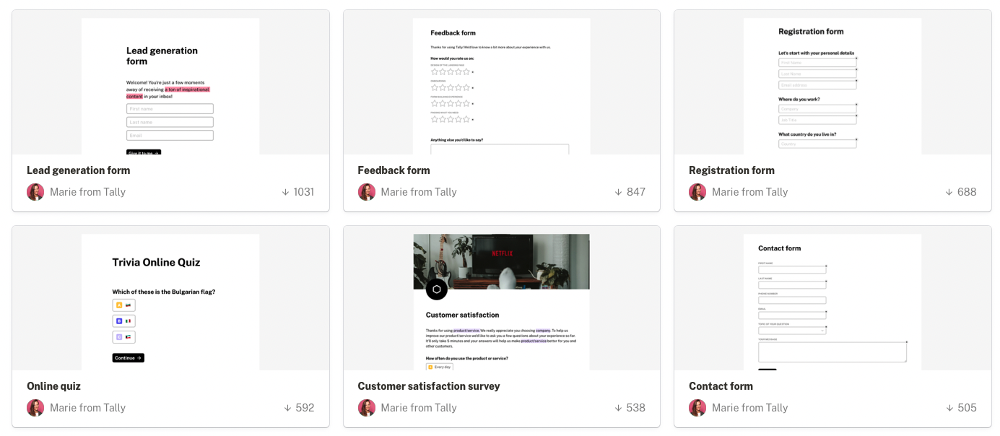
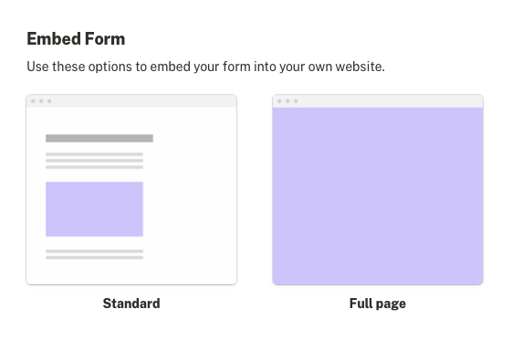
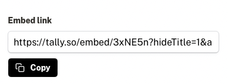

# Sulvahmi Dzakwan (1)

Hello, I'm an Information Systems student with a GPA of 3.40, focused on data analysis and information systems development.

I've honed this through a Point-of-Sale website development project for a small business (MSME), along with professional certifications in data engineering and machine learning. I'm interested in building a career in technology that combines data with practical solutions to real-world problems.

.png)

[Skills](Skills%20279ebcb84cbf828ab26901bbe071949f.csv)

[Projects](Projects%20dc8ebcb84cbf828fa24e01c9bbbfe713.csv)

[Certifications](Certifications%20300ebcb84cbf83ea834081bffe5ce4df.csv)

[Contacts](Contacts%203beebcb84cbf8298b7a681093604bc25.csv)

<aside>
**FAQs**

---

- **How to publish your website**
    1. Click on “Share” on the top right corner
    2. Go to “Publish” and click “Publish.”
    3. Toggle off “Duplicate as template.”
    4. Copy the link to share your website with others.

---

- **How to embed a form in Notion**
    1. Create a free account at [tally.so](https://tally.so/)
    2. Click on create form or use one of the templates
        
        
        
    3. Customise the form
    4. Publish the form
    5. Go to Share, and click on Standard under Embed Form
        
        
        
    6. Copy the Embed link
        
        
        
    7. Create an Embed block in Notion, then paste the link

---

</aside>